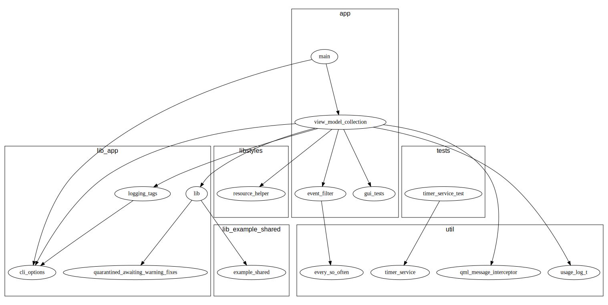

## Diagram C/C++ Source File Inter-Dependencies Within a Project

### What is this?

This folder has scripts for C/C++ dependency graphing.

These scripts use the [Graphviz](https://graphviz.org/) `dot` tool to produce an
SVG image visualizing the header-include graph of a C/C++ codebase.

You can apply these scripts to your entire C/C++ codebase, or you can visualize
any subset of your code, bounding the input to specific subdirectories of your
codebase.

Original inspiration taken from https://www.flourish.org/cinclude2dot/, but here
we use a novel implementation in python, with different cli options and slightly
different output (though the output of both is in the `dot` graphviz language).

You can copy this `sw_arch_doc` folder into any project (or just copy it
somewhere on your system) and run the script against any folder or set of
folders of C/C++ source files you like.

When choosing which folder(s) of source files to diagram, we recommend not
attempting to diagram more than ~100 files at a time, or the diagram will be
very dense and hard to read.

By default, the diagrams will look like the one shown here. You can optionally
apply added styling to your graph(s).



### How do I use this?

**TL;DR**

```
./generate_graph.sh -s ${SOURCE_PATH_1} ${SOURCE_PATH_2} -x ${TEXT_FILE_WITH_YOUR_EXCLUDES}
```

The generated diagram will be: `all_src.svg`

**Required:** `dot` (from the graphviz package) must be installed on your sytem.

For detailed help, run:
```
./generate_graph.sh --help
```

If you prefer to alter the appearance of the graph by using different (or
additional) graph attributes, edit the file `dot_head.part` with the
[graphviz attributes](https://graphviz.org/doc/info/attrs.html) that you
prefer. Options include: dpi, font, landscape. Refer to
[graphviz documentation](https://graphviz.org/doc/info/attrs.html).

`generate_graph.sh` will use the content of `dot_head.part` as the header of the
graph each time the graph is (re-)generated. The `generate_graph.sh` script does
not alter `dot_head.part`, which is what makes it the proper place to hardcode
your preferred graph attributes.

#### Exclusions

Many projects have header files such as `defs.h` or `utils.h`, and it is usually
desirable to exclude these headers from the generated diagram.

For any/all header(s) you wish to ignore and exclude from the visualization,
list the *stem* of the header name in a file such as `excludes.txt`, listing one
*stem* name per line. Pass your `excludes.txt` to the script like so:

```
./generate_graph.sh -s ${SOURCE_PATH_1} ${SOURCE_PATH_2} -x excludes.txt
```

See the example `excludes.txt` in this folder.

For example, to remove `defs.h` from the diagram, you would add the following line:

```
defs
```

### My diagram looks like a tangle of spaghetti. Now what?

There are several reasons that can cause you to end up with spaghetti.

First, we recommend not attempting to diagram more than ~100 files at a
time. This means you should make sure that the number of C/C++ source files
residing under whatever directory or directories you chose as the `-s` (or
long-name `--src-dir`) argument does not exceed 100 total source files. When
counting files under `--src-dir`, any files in nested subdirectories count, too!

Second, please recall the advice above regarding explicit exclusions for common
files such as `defs.h`. If your generated diagram is large, you can usually spot
some nodes in the diagram with a disproportionately large number of incoming
arrows/edges. Often those nodes represent utility files (such as `log.h`,
`string.h`, etc.), and are good candidates for exclusion.

Lastly, your project may just suffer from many unnecessary `#include`(s)! The
diagram is based on the idea that if a source file specifies to `#include` a
particular header, that happens if-and-only-if the source file really depends on
what is in that header! The diagram will generate an arrow/edge between those
two files under the assumption that there exists such a dependency. If your
project does not have "good hygiene" about removing `#include` directives when
they become out-of-date, then your diagram may end up with a lot of nodes and
edges that should not really be there. In this case, you may wish to run a tool
such as [deheader](http://www.catb.org/~esr/deheader/). After you identify and
remove spurious `#include` lines from your sources, then re-run
`generate_graph.sh` and you should see a smaller diagram.

You might find that generating the diagram regularly (during every build, even!)
gives you a good way to notice spurious `#include` edges and stay on top of your
header hygiene.
